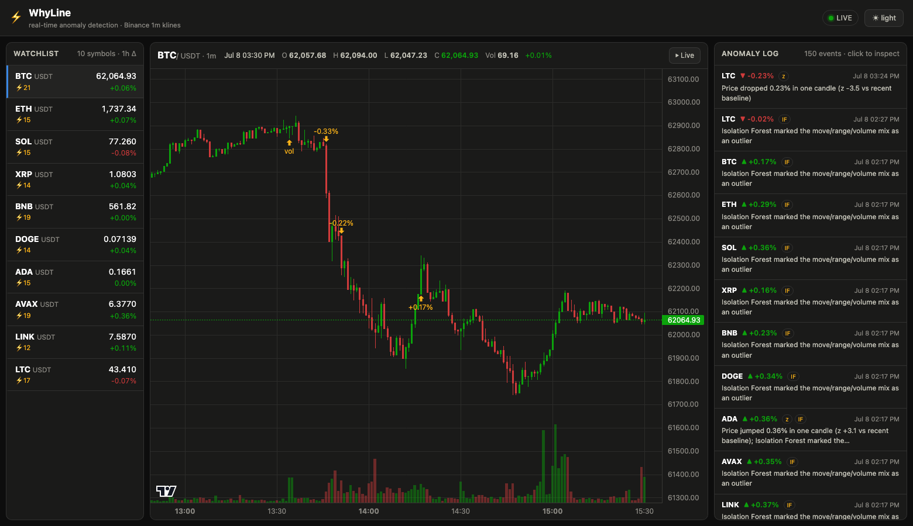
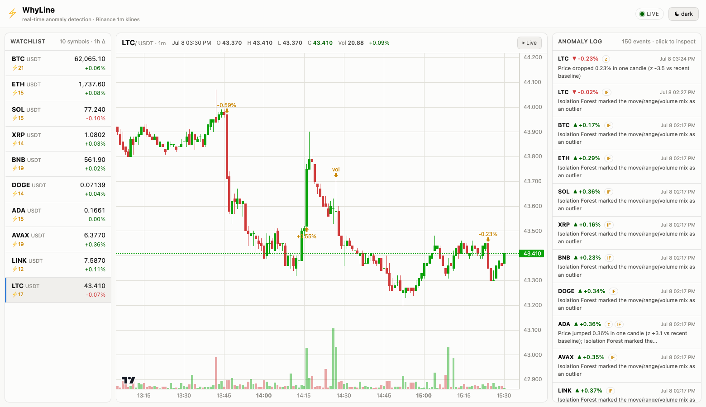
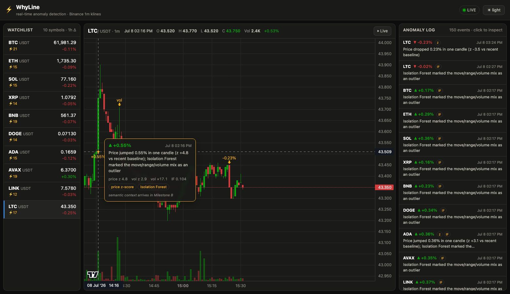

# WhyLine

**Real-Time Anomaly Detection and Semantic Event Mapping in Financial Time Series.**

WhyLine watches live crypto markets, statistically detects the moment something
*sudden* happens (price spikes, volume surges, multivariate outliers), marks it
on a live candlestick chart, and explains the surrounding context by attaching
sentiment-scored crypto news to each anomaly.

## Status

- ✅ **Milestone A (done)** — the quantitative half: live Binance ingest →
  z-score + Isolation Forest detection → live chart with historical backfill,
  anomaly markers, tooltips, watchlist, anomaly log, dark/light themes.
- ✅ **Milestone B (done)** — the semantic half: every live anomaly broadcasts
  immediately with `attribution: pending`, then is enriched asynchronously
  with Finnhub crypto news + FinBERT headline sentiment. Historical
  anomalies from the startup scan are enriched the same way in the
  background. The UI renders
  **real news only** — sample/fallback headlines are never displayed.

## Architecture

```
            Binance (public market data, no API key)
      REST /api/v3/klines          WS <sym>@kline_1m  x10 symbols
               │                          │
               ▼                          ▼
    ┌──────────────────────────────────────────────┐
    │              backend (FastAPI)               │
    │  ingest.py    backfill 1000 candles/symbol   │
    │               + live stream, reconnect+resync│
    │  detect.py    rolling z-score (returns, vol) │
    │               + Isolation Forest (streaming  │
    │               refits; offline scan for       │
    │               backfilled history)            │
    │  state.py     per-symbol candles/anomalies,  │
    │               authoritative attribution      │
    │               state, WebSocket broadcaster   │
    │  main.py      GET /api/history/{sym}         │
    │               GET /api/anomalies, /ws        │
    │  attribute.py async news + sentiment per live│
    │               anomaly (pending → ok)         │
    │  news.py      Finnhub crypto news (real      │
    │               articles; sample fallback kept │
    │               server-side only, never shown) │
    │  sentiment.py FinBERT headline tone          │
    └──────────────────────┬───────────────────────┘
          candles + anomaly + attribution events (JSON over /ws)
                           ▼
    ┌──────────────────────────────────────────────┐
    │        frontend (Vite + React + TS)          │
    │  Lightweight Charts v5 candlesticks + volume │
    │  amber anomaly markers + evidence tooltip    │
    │  watchlist (10 symbols) · anomaly log        │
    │  Related-news cards (real articles only)     │
    │  dark / light themes                         │
    └──────────────────────────────────────────────┘
```

## Stack

- **Backend:** Python 3.14, FastAPI + uvicorn, websockets, httpx,
  numpy/pandas/scikit-learn, pydantic, python-dotenv, transformers + torch
  (FinBERT, lazy-loaded on CPU). See `backend/requirements.txt`.
- **Frontend:** Node 24, React 19, Vite 8, TypeScript 6,
  lightweight-charts 5.2.0. See `frontend/package.json`.
- **Market data source:** Binance public market-data API (REST backfill at
  `https://data-api.binance.vision`, live kline stream at
  `wss://data-stream.binance.vision`). No Binance API key required.

## Monitored symbols

10 deep-liquidity USDT pairs at the 1-minute interval (override with
`SYMBOLS=` in `backend/.env`):

| Symbol | Typical context behind sudden moves |
|---|---|
| BTCUSDT | macro prints, ETF flows |
| ETHUSDT | ETF news, protocol upgrades |
| SOLUSDT | ecosystem news, network outages |
| XRPUSDT | regulatory / court rulings |
| BNBUSDT | Binance exchange news |
| DOGEUSDT | social-media (celebrity) posts |
| ADAUSDT | protocol milestones |
| AVAXUSDT | ecosystem / partnership news |
| LINKUSDT | partnership announcements |
| LTCUSDT | payments adoption, halving cycles |

## Detection methods

Each *closed* candle is scored three ways:

1. **Return z-score** — log-return vs. a trailing 60-candle baseline that
   excludes the current candle; flags `|z| ≥ 3`.
2. **Volume z-score** — log-volume vs. the same style of baseline, one-sided,
   flags `z ≥ 3.5`.
3. **Isolation Forest** — multivariate outlier score over
   `[log-return, high-low range, log-volume]` (100 estimators,
   contamination 0.01, rolling 240-row buffer, refit every 15 candles);
   catches unusual *combinations* the individual z-scores miss.

Flags merge into one anomaly event with a plain-English explanation,
deduplicated per candle and rate-limited by a per-symbol cooldown.
Tune thresholds against real history with `python backend/tune.py`.

## Attribution pipeline

1. Detector flags a live candle → anomaly stored in the authoritative
   `MarketState`, immediately marked `attribution: pending` **before** any
   broadcast (REST can never observe a live anomaly with `null`).
2. `anomaly` WebSocket event broadcasts instantly — the feed never waits.
3. A background task fetches Finnhub crypto news and scores headline tone
   with FinBERT in a worker thread.
4. The final `Attribution` is written to the **same stored anomaly** and a
   separate `attribution` WebSocket event broadcasts it.
5. REST (`/api/anomalies`, `/api/history`) and WebSocket always expose the
   same authoritative state; the frontend store merges updates by anomaly id.
6. After startup, a background pass (`attribute_history` in `main.py`)
   marks every historical anomaly `pending` and attributes them one at a
   time, newest first, through the same `run_attribution` path. Anomalies
   carry `live: true|false` so the UI can still tell live detections apart.

## Real news provider

Finnhub market news (`GET {NEWS_API_BASE}/news?category=crypto`, token in
the `X-Finnhub-Token` header, never in the URL). All symbols share one
category request (deduplicated by a short TTL cache); relevance is decided
locally in three tiers: strict 1 h time window + asset keyword →
relaxed 24 h lookback + keyword → most-recent general crypto headlines
(explicitly marked `broad_market`). Every served article keeps its real
headline, source, URL, and timestamp. Measured coverage: 10/10 monitored
symbols yield real articles (5 asset-specific, 5 broad-market); see
`docs/evaluation_report.md`.

## Sentiment analysis

FinBERT (`ProsusAI/finbert`) scores headline *tone* as
`P(positive) − P(negative)` with a label of positive/negative/neutral.
Tone is not a price signal, and a missing score stays missing (never
defaulted to neutral). First use downloads the model once (~hundreds of MB
into the Hugging Face cache); later runs reuse it.

## WebSocket / live updates

- `GET /ws` streams `hello` → `candle` → `anomaly` → `attribution` JSON
  messages with auto-reconnect (capped exponential backoff) and a
  reconnect resync that replays missed closed candles exactly once.
- The chart consumes the feed imperatively; lists subscribe via
  `useSyncExternalStore`. History reloads never downgrade known
  `pending`/final attribution states.

## Historical vs fallback behavior

- **Historical anomalies** (backfill scan at startup) are attributed in the
  background after startup, using the same time-bounded matching as live
  ones (news from up to 24 h before to 15 min after the anomaly). They
  carry `live: false`.
- **Fallback (sample) headlines** exist server-side for no-key /
  provider-failure / empty-feed cases so the pipeline never crashes, but
  the UI deliberately never renders them: those states show `Finding
  related news...`, `No related news found.`, or `Related news
  unavailable.`

## API endpoints

| Endpoint | Description |
|---|---|
| `GET /api/health` | status, WS client count, symbol count |
| `GET /api/symbols` | monitored symbols + interval |
| `GET /api/history/{symbol}` | closed candles (+forming) and anomalies |
| `GET /api/anomalies?limit=N` | newest anomalies across symbols, with attribution |
| `GET /ws` (WebSocket) | live `hello`/`candle`/`anomaly`/`attribution` feed |

## Run it

Backend (Python 3.14):

```bash
cd backend
python -m venv venv && source venv/bin/activate   # Windows: venv\Scripts\activate
pip install -r requirements.txt
uvicorn main:app --port 8000
```

Frontend (Node 24), in a second terminal:

```bash
cd frontend
npm install
npm run dev        # http://localhost:5173 (proxies /api and /ws to :8000)
npm run build      # type-check + production build into dist/
```

On startup the backend backfills ~1000 one-minute candles per symbol
(~16 h), back-scans them so the chart opens **already annotated with
historical anomalies**, then switches to the live stream.

## Environment variables

All optional; see `backend/.env.example` for the full list with defaults.
Key groups: `SYMBOLS`, `INTERVAL`, `HISTORY_LIMIT`, Binance hosts,
detector thresholds (`DETECT_WINDOW`, `DETECT_MIN_PERIODS`,
`RETURN_Z_THRESHOLD`, `VOLUME_Z_THRESHOLD`, `ANOMALY_COOLDOWN`),
Isolation Forest (`IFOREST_BUFFER`, `IFOREST_MIN_BUFFER`,
`IFOREST_REFIT_EVERY`, `IFOREST_CONTAMINATION`), news
(`NEWS_API_BASE`, `NEWS_WINDOW_BEFORE/AFTER`, `NEWS_RELAXED_WINDOW_BEFORE`,
`NEWS_CACHE_TTL`, `NEWS_TIMEOUT`, `NEWS_FALLBACK_ENABLED`), sentiment
(`SENTIMENT_ENABLED`, `SENTIMENT_MODEL`), `ATTRIBUTION_ENABLED`.

## Finnhub API key configuration

Real news needs a free Finnhub key (https://finnhub.io/dashboard).
Put it in `backend/.env` (gitignored — never commit it):

```bash
FINNHUB_API_KEY=your_key_here
```

`NEWS_API_KEY` is accepted as a legacy alias (`FINNHUB_API_KEY` takes
precedence). Without a key the pipeline still works end-to-end but serves
sample fallback headlines internally, which the UI does not render.

## Security

- The real key lives **only** in `backend/.env`, which is gitignored
  (`.gitignore: .env`) and never transmitted: it is sent solely in the
  server-side `X-Finnhub-Token` request header, never in URLs, API
  responses, WebSocket messages, frontend code, logs, or commits.
- `Settings` hides the key from `repr`; tests assert it never appears in
  REST/WebSocket payloads.

## Tests

```bash
cd backend && python -m pytest tests -q     # 206 passed, fully offline
cd backend && python eval_perf.py            # latency benchmarks (offline)
cd backend && python eval_perf.py --binance  # + one live Binance fetch
cd backend && python tune.py                 # threshold back-test (network)
cd frontend && npm run test:store            # store merge checks (10)
cd frontend && npm run test:views            # AttributionView render checks (17)
cd frontend && npm run build                 # tsc + vite production build
```

Backend tests are fully mocked (no network, no API key needed) and cover
detection math, streaming/batch agreement, API/state behavior, the live
pending → attribution flow, Finnhub mapping/failures, and key isolation.
Full results and measured latencies: `docs/evaluation_report.md`.

## Known limitations

- Free-tier news sparsity: asset-specific matches may be hours old
  (served via the relaxed 24 h lookback with visible timestamps) or fall
  back to explicitly marked broad-market context; symbols with no provider
  coverage at all fall back server-side (never displayed).
- No labeled ground truth exists, so false-positive/false-negative rates
  and sentiment accuracy are not reported (marked N/A in the evaluation).
- Attribution latency is seconds (Finnhub + FinBERT), intentionally
  asynchronous so the 1-minute feed never stalls.
- News is temporally associated context, never proof of causation.

## Screenshots

| Dark | Light | Anomaly tooltip |
|---|---|---|
|  |  |  |

## Team

- Rashmin Chaudhari
- Avantee Sarve
- Shambhavi Tongaonkar
- Swayam Takkamore

Dept. of Computer Science and Business Systems </br>
St. Vincent Pallotti College of Engineering & Technology, Nagpur.
